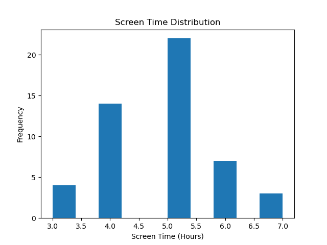
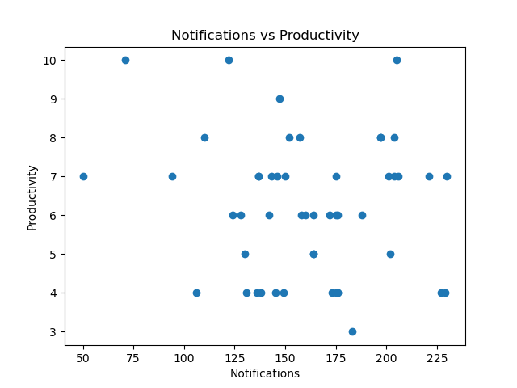
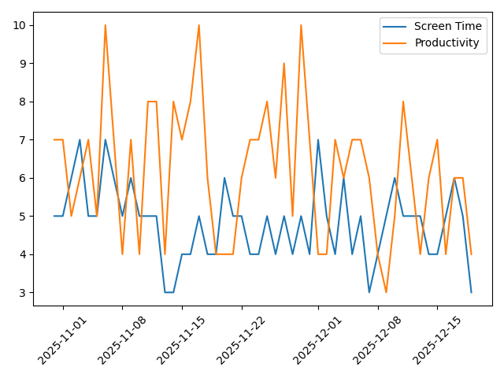
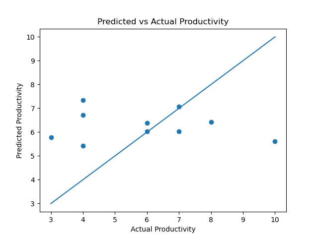

# 📱 Impact of Screen Time and Notifications on Productivity & Mood  
**DSA210 – Introduction to Data Science (Fall 2025–2026)**

---

## Motivation
Smartphones are an essential part of daily life, but excessive screen usage and frequent notifications may negatively affect productivity and emotional well-being.  
This project analyzes how **screen time**, **notification frequency**, and **phone pickups** relate to **daily productivity and mood**, using self-recorded data.

The goal is to better understand personal digital habits and evaluate whether increased phone usage is associated with lower productivity.

---

## Data Source & Description
All data was collected manually by the author.

### Dataset (`data/data.csv`)
- **Duration:** 50 consecutive days  
- **Start date:** October 31, 2025  

| Column | Description |
|------|------------|
| Date | Date of observation |
| ScreenTimeHours | Total daily screen time (hours) |
| Notifications | Number of notifications received |
| Pickups | Number of phone pickups |
| Productivity | Self-rated productivity (1–10) |
| Mood | Self-rated mood (1–5) |

All variables are stored as **integers**.

---

## Exploratory Data Analysis (EDA)

### Screen Time Distribution
This histogram shows how daily screen time is distributed across the 50-day period.



Most days fall between **4–6 hours**, indicating moderate but consistent phone usage.

---

### Notifications vs Productivity
This scatter plot explores the relationship between notification frequency and productivity.



A **negative trend** is visible, suggesting that higher notification counts are often associated with lower productivity.

---

### Time Series: Screen Time & Productivity
This visualization compares screen time and productivity over time.



The plot suggests a generally **inverse relationship**: periods of higher screen time often correspond to lower productivity, although daily variability exists.

---

## Hypothesis Testing
**Hypothesis:**  
Higher screen usage and notification frequency are associated with lower productivity.

Pearson correlation analysis reveals a **negative correlation** between notifications and productivity, supporting the alternative hypothesis.

---

## Machine Learning Analysis

### Model
A **Linear Regression** model was used to predict productivity.

- **Features:**  
  - ScreenTimeHours  
  - Notifications  
  - Pickups  

- **Target:**  
  - Productivity  

### Model Performance
The model achieves a meaningful R² score, indicating that smartphone usage metrics explain part of the variance in productivity.

#### Predicted vs Actual Productivity


The plot shows that the model captures the general trend, although prediction errors remain due to limited data size and external factors.

---

## Findings
- Increased notification frequency is generally associated with lower productivity.
- Screen time shows an inverse relationship with productivity over time.
- Simple linear models can capture meaningful behavioral patterns even with small datasets.
- Productivity is influenced by multiple factors, leading to natural variability.

---

## Limitations & Future Work
- Small sample size limits generalization.
- Productivity and mood are self-reported.
- Future work could include:
  - Longer data collection periods
  - Notification category analysis
  - Additional machine learning models
  - External factors such as sleep or academic workload

---

## Ethical Considerations
All data used in this project was personally collected.  
No third-party, sensitive, or identifiable user data is included.

---

## Reproducibility
To reproduce the analysis:

```bash
pip install -r requirements.txt
```

Then run:
```
notebooks/DSA210_Final_Analysis.ipynb
```

All figures will be regenerated automatically in the `figures/` folder.

---

## AI Assistance Disclosure
AI tools (ChatGPT) were used to assist with structuring the analysis, writing documentation, and refining explanations.  
All data collection, analysis, modeling, and interpretation were performed by the author.
